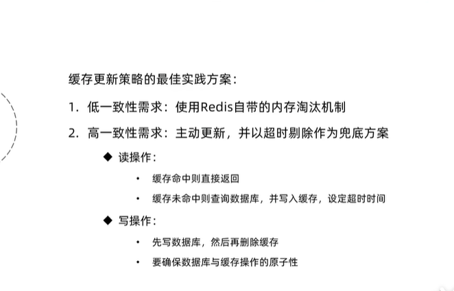
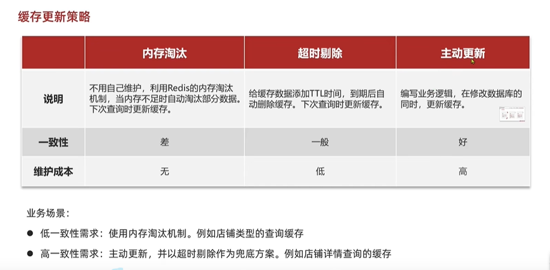
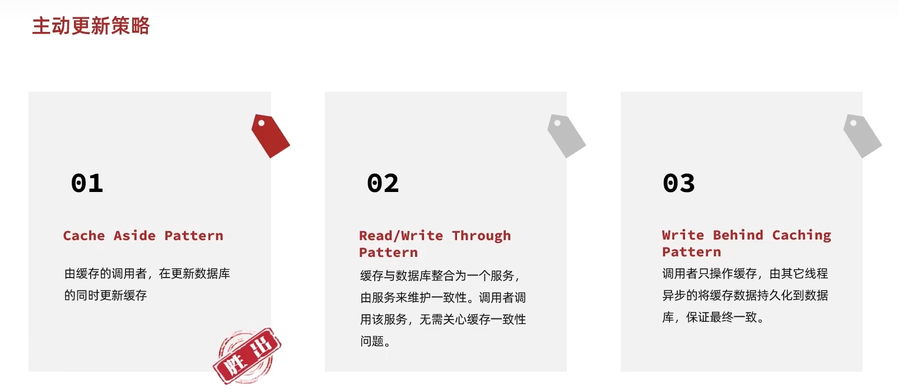
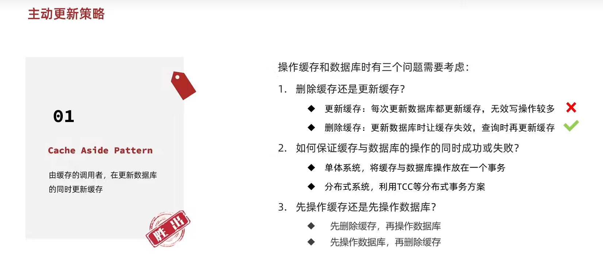
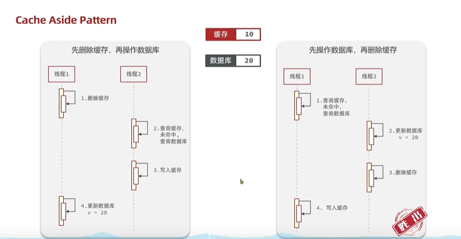
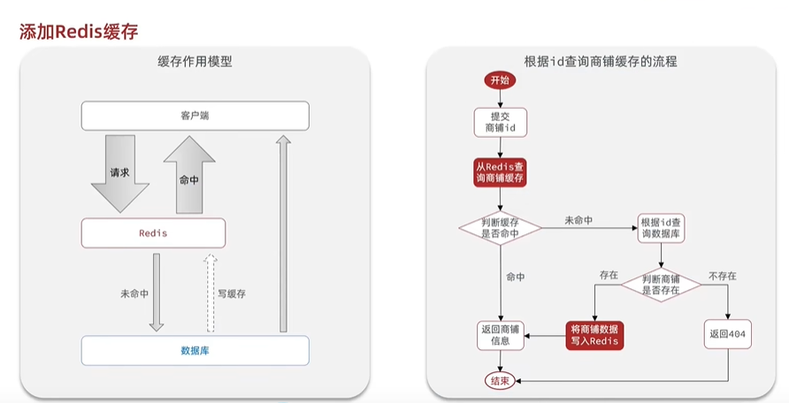

##### 1.什么是缓存
缓存是数据交换的缓冲区,是存储数据的临时地方，
一般读写性能较高

优点:降低后端的负载，提高读写效率，降低响应时间

`成本:数据一致性成本,代码维护成本,运维成本`

##### 2.缓存更新策略
总结:

更新策略:

主动更新策略:

主动更新策略需要考虑的问题:

先操作数据库更新再删除比较保,更新一般比较慢,删除操作较快

##### 3.缓存穿透

##### 4.缓存雪崩

##### 5.缓存击穿

##### 6.添加redis缓存

