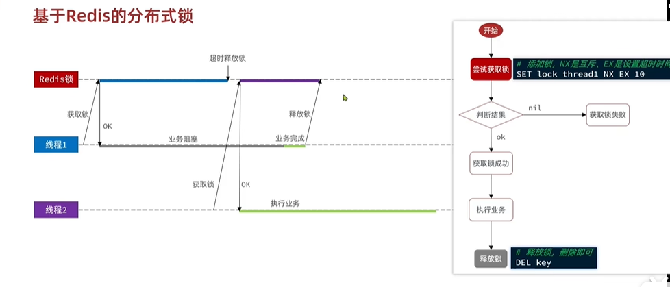
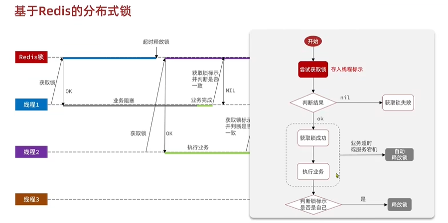
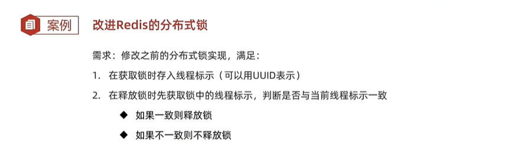
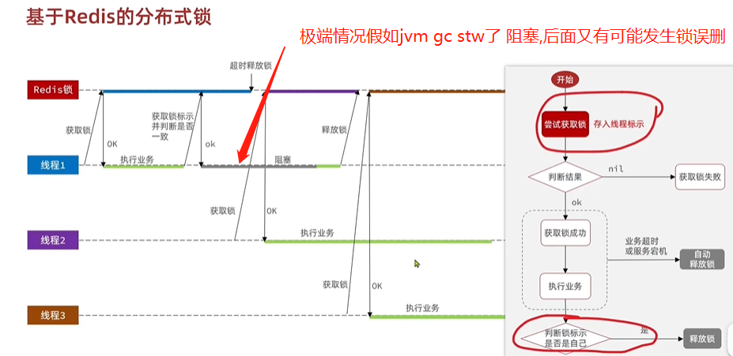
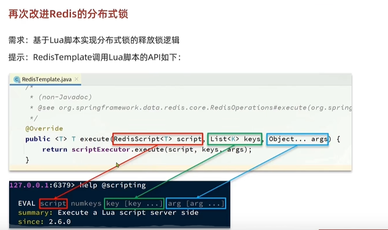
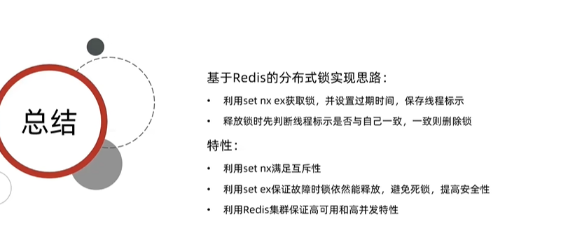
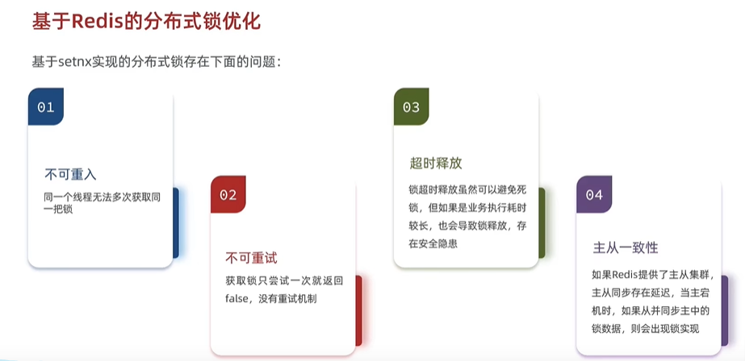
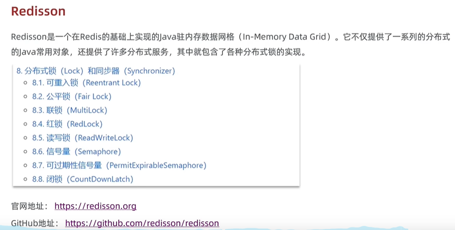
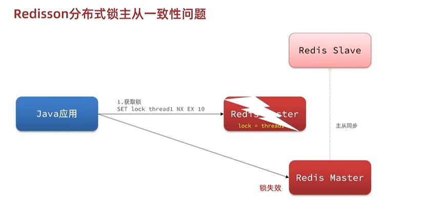
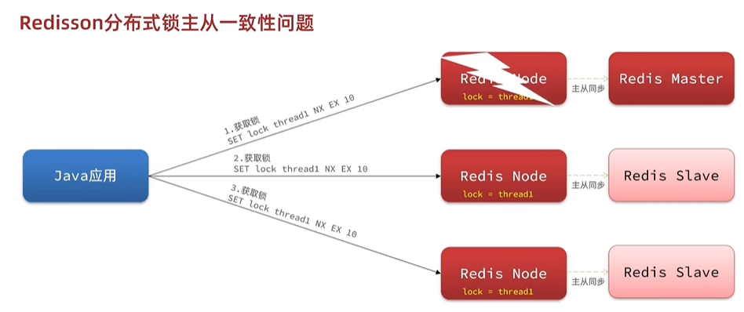

hi distributed lock

Redis分布式锁实现V1

分布式锁v1超时释放问题

解决分布式锁v1超时释放问题,判断锁标识是否是属于自己

解决分布式锁v1超时释放问题,判断锁标识和释放锁是2个独立的动作,判断了标识,但是释放阻塞了,GC stw 阻塞 超时释放 (lua
多命令原子性)

锁的标识判断与释放原子性

总结

distributed lock issue in extreme case

Redisson   

Redisson 解决锁在集群中同步的一致性问题

解决锁在集群中同步的一致性问题 multilock

