hi redis queue

sec-kill-issue  访问db逻辑太多了 耗时

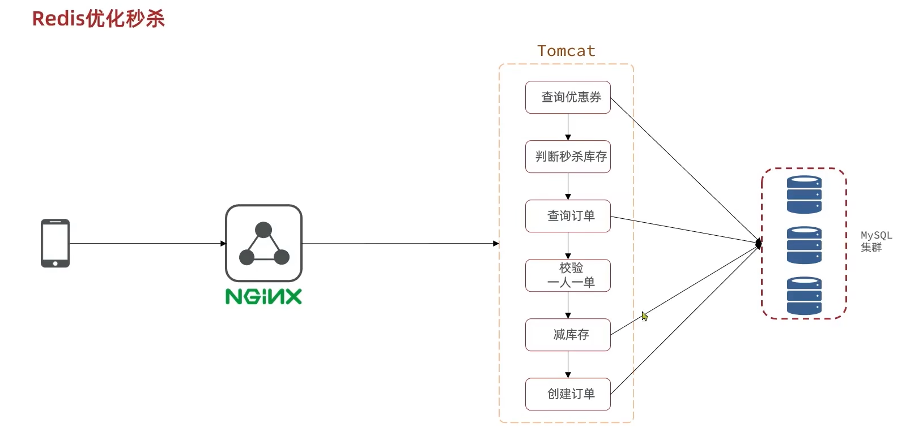

optimize sec-kill-issue redis 队列 异步

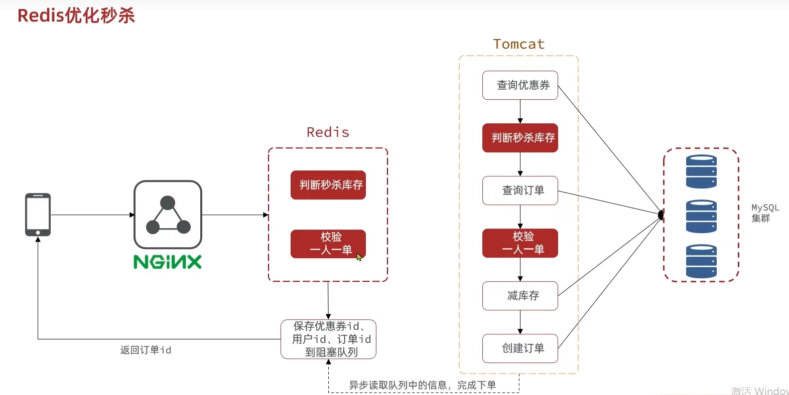

optimize sec-kill-issue redis 队列 异步

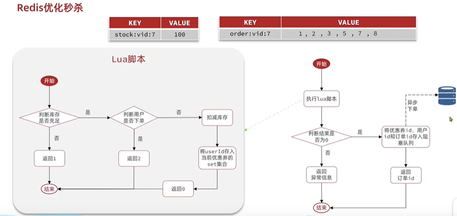

optimize sec-kill-issue ideas

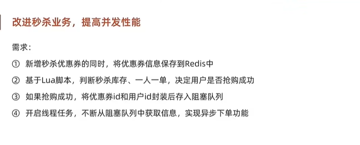

optimize sec-kill-issue memory JVM 内存实现的阻塞队列问题 内存限制,数据安全等问题 无持久化机制

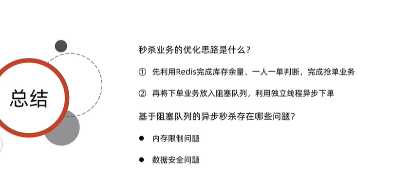

redis queue

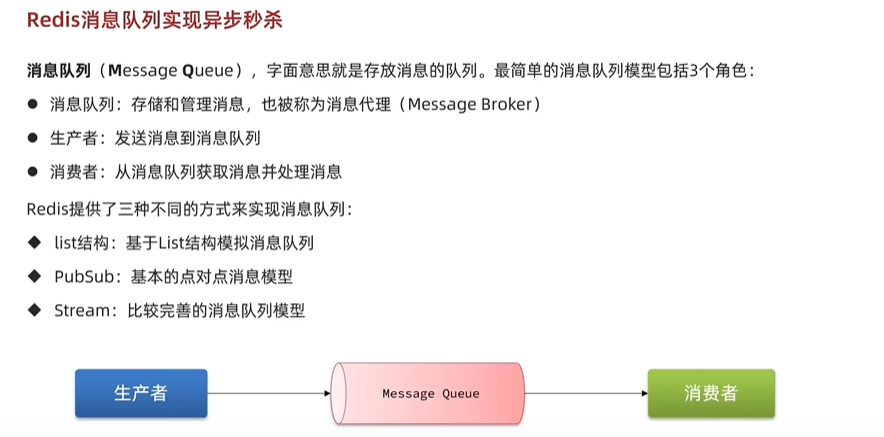

redis queue list

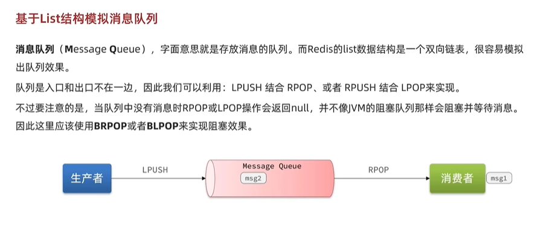
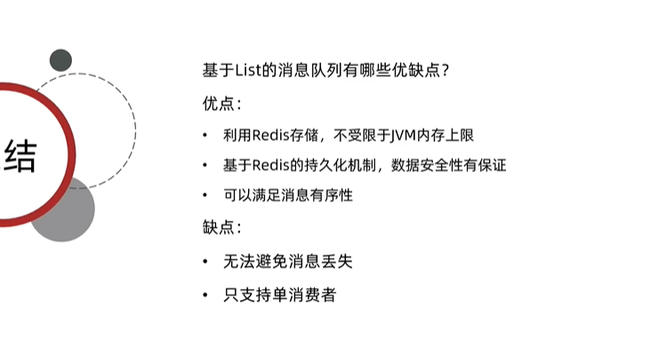

redis queue pub sub

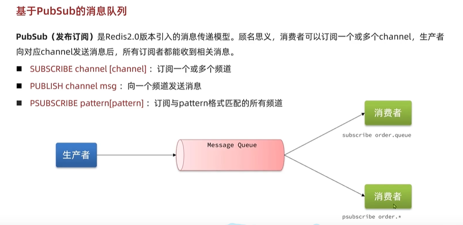
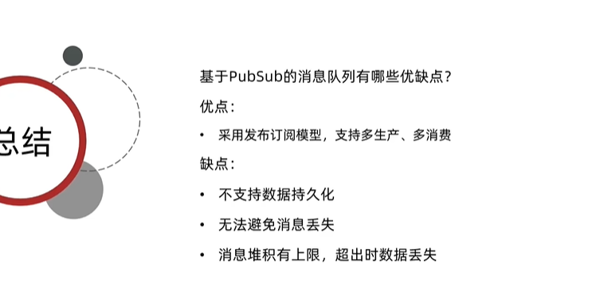

redis queue stream

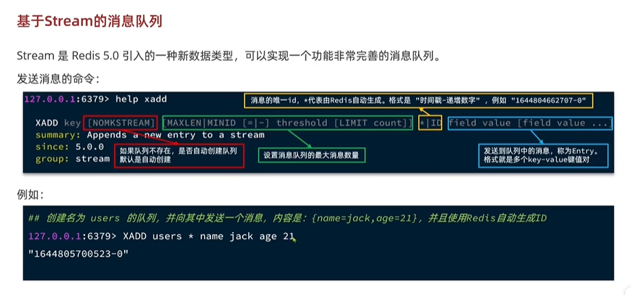
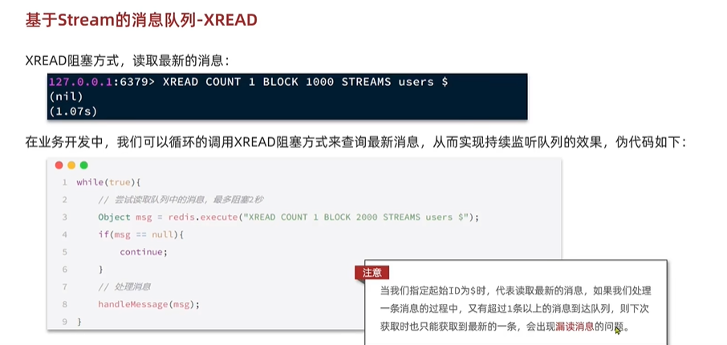
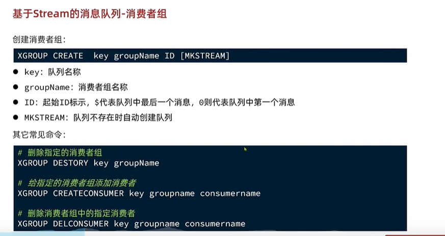
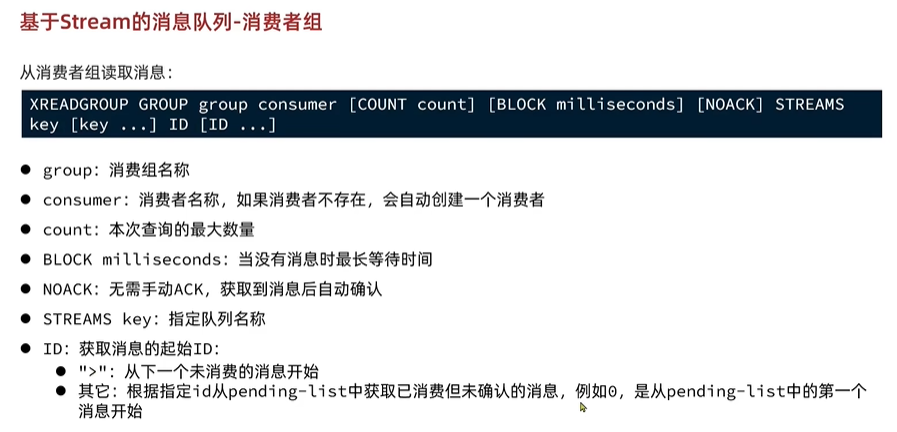

stream redis 总结
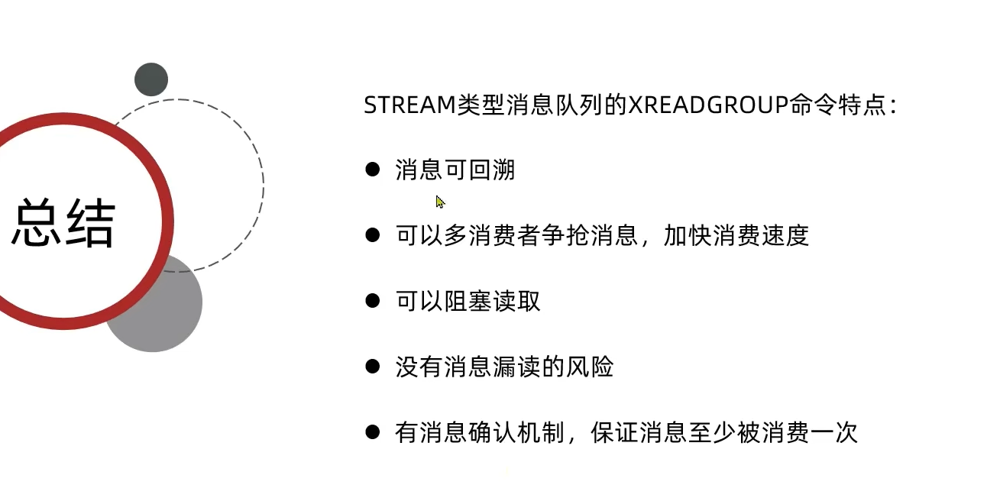
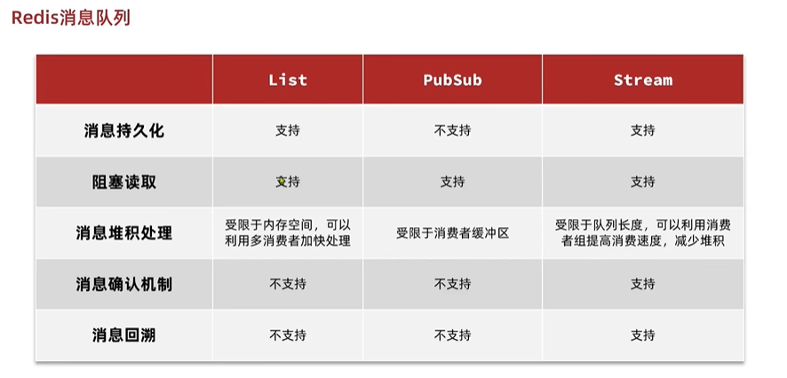

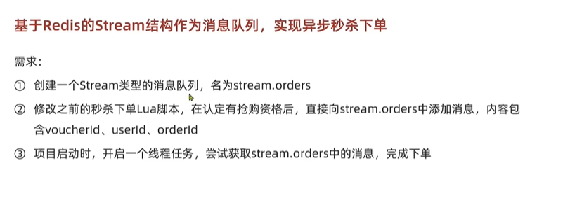

