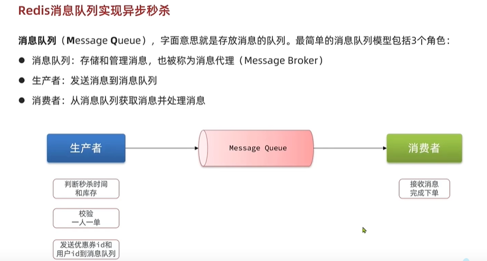

hi redis queue

sec-kill-issue  访问db逻辑太多了 耗时

optimize sec-kill-issue redis 队列 异步

optimize sec-kill-issue redis 队列 异步

optimize sec-kill-issue ideas

optimize sec-kill-issue memory JVM 内存实现的阻塞队列问题 内存限制,数据安全等问题 无持久化机制

redis queue

redis queue list

redis queue pub sub

redis queue stream

stream redis 总结

